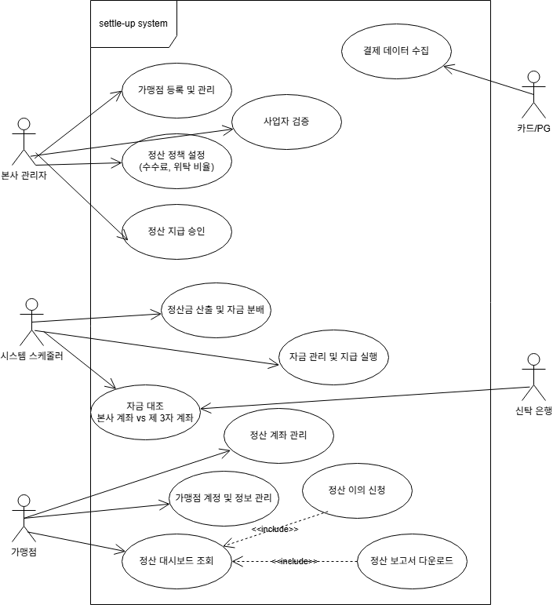
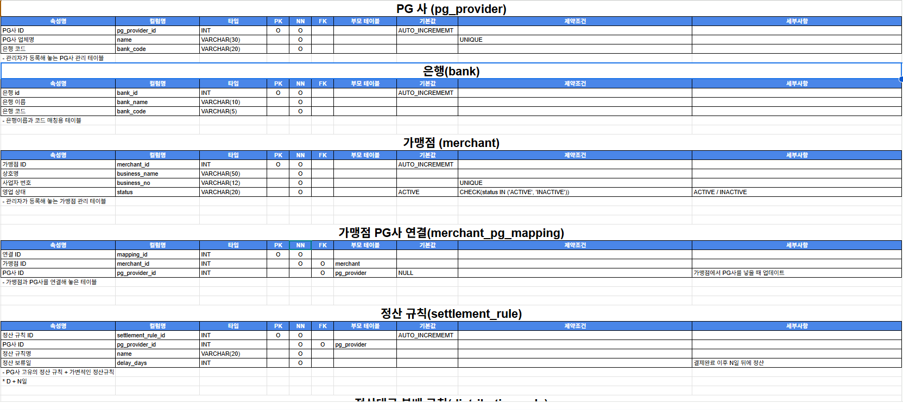
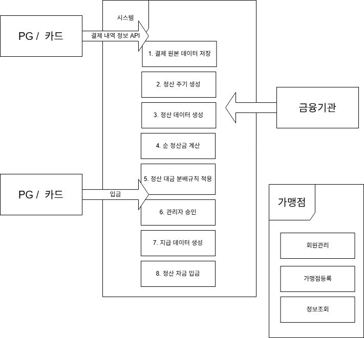

# 🔐 신탁 기반 정산 시스템

# 👥 flow - 팀원 소개

<table>
  <tr> 
    <th colspan = "6" align = "center"> flow </th> 
  </tr>
  
  <tr>
    <th>김진혁</th>
    <th>박하얀</th>
    <th>양준석</th>
    <th>이진</th>
    <th>한규진</th>
    <th>황희수
  </tr>
  
  <tr>
    <td align="center"></td>
    <td align="center"></td>   
    <td align="center"></td>   
    <td align="center"></td>  
    <td align="center"></td>   
    <td align="center"></td>  
  </tr>

  <tr>
    <td align="center">
      
    </td> 
    <td align="center">
      
    </td>
    <td align="center">
      
    </td>
    <td align="center">
      
    </td>
    <td align="center">
      
    </td>
    <td align="center">
      
    </td>
  </tr>
</table>
    
---

# 🧭 목차

1. [📚 프로젝트 개요](#1--프로젝트-개요) 
    1-1. [✨ 주제](#1-1--주제) 
    1-2. [💡 개발 배경 및 필요성](#1-2--개발-배경-및-필요성)
2. [🛠️ 주요 기능](#2-%EF%B8%8F-주요-기능) 
    2-1. [🎯 서비스 목표](#2-1--서비스-목표)
3. [📅 WBS](#3--wbs)
4. [🧾 요구사항 명세서](#4--요구사항-명세서)
5. [🧵 유스케이스](#5--유스케이스)
6. [🧩 ERD](#6--erd)
7. [📋 테이블 명세서](#7--테이블-명세서)
8. [🗄️ SQL](#8-%EF%B8%8F-sql)
9. [⚙️ 프로시저](#9-%EF%B8%8F-프로시저)
10. [📰 시나리오](#10--시나리오)
11. [💬 팀회고](#11--팀회고)
---

# 1. 📚 프로젝트 개요

#### 1-1. ✨ 주제

#### 1-2. 💡 개발 배경 및 필요성

---

# 2. 🛠️ 주요 기능

#### 2-1. 🎯 서비스 목표

---

# 3. 📅 WBS
이미지 
[ WBS (프로젝트 진행 일정)](https://docs.google.com/spreadsheets/d/15r640vRfC-G8uQ3YBSAxLdvZtq2MuxxO7RWO78nD-6M/edit?gid=0#gid=0)

---

# 4. 🧾 요구사항 명세서
 
[ 요구사항 명세서 ](https://docs.google.com/spreadsheets/d/1t-3yzFlvFUKhRYMtjQxSj4t5rjAZPjR0/edit?gid=1080029165#gid=1080029165)

---

# 5. 🧵 유스케이스
확정X) 

---

# 6. 🧩 ERD

---

# 7. 📋 테이블 명세서
 
[ 테이블 명세서 ](https://docs.google.com/spreadsheets/d/1GI8Nhlo6Zvqm3CNvxjKK17xeaG-IVI5IMGtB0OgICOE/edit?gid=993473287#gid=993473287)

---

# 8. 🗄️ SQL

---

# 9. ⚙️ 프로시저

---

# 10. 📰 시나리오
확정X) 

---

# 11. 💬 팀회고

#### 🦊김진혁
> 시도하였던 것

> 좋았던 점

> 아쉬웠던 점

#### 🐹박하얀
> 시도하였던 것

> 좋았던 점

> 아쉬웠던 점

#### 🐑양준석
> 시도하였던 것

> 좋았던 점

> 아쉬웠던 점

#### 🥔이진
> 시도하였던 것

> 좋았던 점

> 아쉬웠던 점

#### 👨‍🚒한규진
> 시도하였던 것

> 좋았던 점

> 아쉬웠던 점

#### 🐻황희수
> 시도하였던 것

> 좋았던 점

> 아쉬웠던 점
